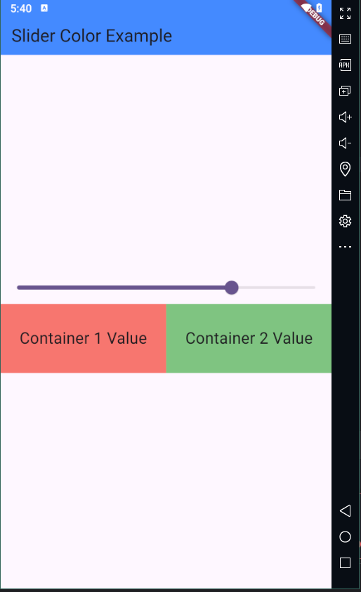

# Provider Package with Examples

>Android. Simple Code
>Use Provider Package wih neat and clean code with multiple examples


## Demo
>Provider Package with different examples


>Counter Screen


>Color opacity change with slider




## Getting Started
clone this repo
```
git clone https://github.com/naumansamtia/provider-with-examples.git provider_with_examples
```
## Connect With Me
Nauman Samtia– [@NaumanSamtia](https://www.linkedin.com/in/naumansamtia/) – naumansamtia3@gmail.com
